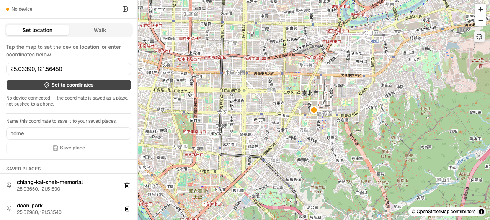
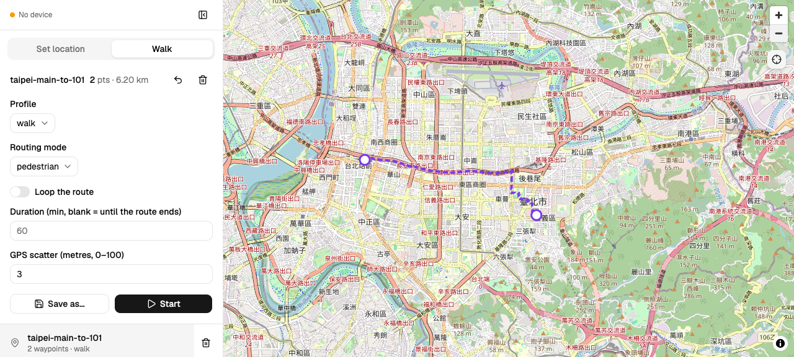

# ios-loc

Simulate GPS location on iOS 17+ devices from your Mac, built on
[`pymobiledevice3`](https://github.com/doronz88/pymobiledevice3).

Two ways to use it:

- **CLI** — hold a fixed point, or walk/cycle a routed path at a realistic pace
  for hours, with speed jitter, occasional pauses, and automatic reconnect if
  the tunnel drops.
- **Local map GUI** — a browser map for drawing routes, saving them, starting a
  walk, and watching the live position, served from `127.0.0.1`.

Nothing leaves your machine except routing requests and map tiles, and it only
ever talks to a device you have physically connected and trusted.

## System requirements

| | |
| --- | --- |
| Host | macOS (Linux may work via `pymobiledevice3`, untested here) |
| Python | 3.13 or newer |
| Package manager | [`uv`](https://docs.astral.sh/uv/) |
| Device | iPhone/iPad on **iOS 17+**, connected by USB and trusted |
| Privileges | `sudo`, once per boot, to start the tunnel daemon |
| Network | Internet for routing and map tiles — both avoidable, see `--offline` |
| GUI only | Node 20+ and [`pnpm`](https://pnpm.io/installation) — the map GUI's assets are built from source, not committed |

iOS 17 moved developer services behind a RemoteXPC tunnel that a privileged
process has to create — that is what `tunneld` below is, and why it needs
`sudo`. There is no Developer Disk Image to mount on modern iOS: the DVT
channel opens once the tunnel is up and the device is unlocked.

## Installation

```bash
git clone https://github.com/geniusgordon/ios-location-sim.git
cd ios-location-sim
uv sync                  # creates .venv and installs the Python side
uv run ios-loc --help
```

That is the whole install for the CLI (`walk`, `set`, `clear`, `doctor`). The
map GUI additionally needs its frontend bundle built once — `web/static/` is
generated output and is deliberately not committed:

```bash
cd src/ios_loc/web/ui
pnpm install
pnpm build               # writes the bundle to ../static
cd -

uv run ios-loc gui       # http://127.0.0.1:8765
```

Rebuild after pulling changes that touch `src/ios_loc/web/ui/`. If you skip
this, `ios-loc gui` refuses to start and prints the build command rather than
serving a blank page. The GUI starts with no device connected — it just shows
nothing to control until one is.

Start tunneld once per boot (needs sudo — it creates the Mac↔iPhone tunnel):

```bash
sudo pymobiledevice3 remote tunneld -d
```

Unlock the device, plug it in, and accept "Trust This Computer" if prompted.
Then check everything is reachable:

```bash
uv run ios-loc doctor
```

```
tunneld:  OK
device:   OK (iOS 26.6)
DVT:      OK — ready to simulate
```

If tunneld is not running, `doctor` says so and prints the command that fixes
it, rather than a traceback.

To install globally instead of running it from the checkout:

```bash
uv tool install .        # runs pnpm build for you; needs Node + pnpm present
ios-loc doctor
```

## Usage

```bash
# Walk a route, looping, for three hours
uv run ios-loc walk --via 25.033,121.565 --via 25.038,121.568 --loop --duration 3h

# Cycle: bike speed AND bicycle routing — two independent flags
uv run ios-loc walk --via 25.033,121.565 --via 25.038,121.568 --pace bike --costing bicycle --loop

# Use a named preset
uv run ios-loc walk home-loop
uv run ios-loc presets list

# Hold a fixed point
uv run ios-loc set 25.0330 121.5654

# Restore real GPS
uv run ios-loc clear
```

`--pace` sets speed only and `--costing` sets how the route is planned
(`pedestrian`, `bicycle`, `auto`); neither one implies the other, so bike speed
along a footpath is a `--pace bike` with the costing left alone.

Other `walk` options worth knowing: `--speed` (m/s, overrides the pace),
`--scatter` (GPS noise in metres, default 3), `--duration` (`90s`, `20m`, `3h`),
`--offline`, `--log FILE`, `--no-clear` to leave the last position in place on
exit, and `--udid` to pick between multiple connected devices.

## Map GUI

```bash
uv run ios-loc gui               # serves 127.0.0.1:8765 and opens a browser
uv run ios-loc gui --no-open --port 9000
uv run ios-loc gui --offline     # disables routing; saved presets still work
uv run ios-loc gui --config ./my.toml   # alternate config file
uv run ios-loc gui --udid <UDID>        # pick a specific device
```

`--host` defaults to `127.0.0.1`; leave it there unless you really want control
of your phone's location reachable from the rest of your network.





The page is a full-screen map beside a sidebar (open by default, collapsible;
it overlays the map on narrow screens). A chip at the top of the sidebar shows
whether a device is currently reachable. The sidebar has two tabs, and the tab
you are on decides what a map tap does:

- **Set location** — a coordinate box (paste `lat,lon`, e.g.
  `48.858666,2.293991`), a save-place form, and your saved places. On this tab,
  tapping the map holds the device at that point — the GUI form of `ios-loc
  set`. Naming a coordinate saves it as a place; picking one sets the device
  there. Stop releases it, same as it ends a walk. With no device connected the
  coordinate is still saved as a place, just not pushed to a phone.
- **Walk** — the route editor and everything a walk needs. On this tab, tapping
  the map adds a waypoint; drag to move one, click it to remove it. Each edit
  re-routes through Valhalla (debounced ~300 ms) and draws the returned
  polyline. Set pace (with its speed shown), routing mode, loop, duration, and
  GPS scatter, then
  Start. Saving writes a `[presets.<name>]` table back to the config, so
  `ios-loc walk <name>` works on anything you draw, and your saved routes are
  listed below the editor. While a walk runs, this tab becomes the live view —
  elapsed, distance, speed, laps, reconnects, and a Stop button.

While a walk runs, the map follows the live dot with a fading trail of the last
120 fixes; panning detaches following and the crosshair button reattaches it.

Two things worth knowing:

- **The run lives in the server process.** Quitting `ios-loc gui` ends the walk.
  A walk started from a terminal is invisible to the GUI, and starting a second
  one from the browser fails at the device layer with the error shown in the UI.
  Relatedly: the GUI server owns the run, and a single Ctrl-C (or a plain
  `kill`/SIGTERM) clears the device and ends the walk before the process exits.
  A second Ctrl-C, or anything that force-kills the process (`kill -9`, a
  crash), skips that cleanup and leaves the device frozen at its last simulated
  location — if that happens, run `ios-loc clear` to recover it.
- **Saving a preset rewrites the `[presets.*]` tables.** Comments and hand
  formatting inside those tables are lost. `[paces.*]` and every other section
  are preserved byte for byte, CRLF included.

The map needs network access for OpenStreetMap tiles even under `--offline`,
which disables routing only.

## Development

```bash
uv run pytest -q                          # full Python suite, ~2s, no device or network
uv run python scripts/export_openapi.py   # regenerate the OpenAPI schema the frontend types from
```

#### Developing the UI

```bash
cd src/ios_loc/web/ui
pnpm dev          # vite on 5173, proxying /api and /ws to uvicorn on 8765
pnpm test run     # pure-logic tests (reducer, store, follow mode, API client)
pnpm build        # writes the bundle to ../static
pnpm lint         # oxlint
pnpm gen:api      # regenerates src/api/schema.d.ts from api-schema.json
```

`src/ios_loc/web/static/` is gitignored build output: `pnpm dev` serves the UI
from source, and `pnpm build` is what `ios-loc gui` reads. Wheels build it
automatically — `uv build` / `uv tool install .` run `pnpm build` through a
hatchling hook (`hatch_build.py`), so a released wheel always carries a bundle
matching its source.

## Config

`~/.config/ios-loc/config.toml` (override with `--config`):

```toml
[paces.jog]
speed = 2.6            # m/s — must stay under 5.56 (20 km/h)
jitter = 0.10
pause_per_min = 0.05
pause_min_s = 5
pause_max_s = 20

[presets.home-loop]
waypoints = [[25.033, 121.5654], [25.038, 121.568], [25.033, 121.5654]]
pace = "walk"
costing = "pedestrian"
loop = true

[places.landmark]
point = [25.033, 121.565]
```

**Paces** describe how fast to move and how often to rest — speed only, nothing
about routing. They layer over the built-in `walk` and `bike`; a new pace name
inherits `walk`'s defaults for the fields it omits. **Presets** are routes with
waypoints, a pace, a costing, and a loop setting, loaded via the GUI or
`ios-loc walk <name>`; the costing lives on the route because it describes the
saved geometry, not on the pace. **Places** are single coordinates saved from
the GUI's Set location tab; picking one sets the device there. Deleting a route
or place from the GUI rewrites this file, preserving comments and hand
formatting outside the `[presets.*]` and `[places.*]` tables — `[paces.*]` and
every other section are untouched.

## Notes

- **Speeds above 20 km/h are rejected.** Location-based games stop crediting
  distance above roughly that speed, so an over-speed run would silently
  produce nothing.
- **An outage costs distance, it never causes a jump.** If the device
  connection stalls mid-run, the walk picks up where it left off instead of
  firing a catch-up burst that would teleport the position.
- **Routes are cached** to `~/.cache/ios-loc/routes`. `--offline` fails fast rather
  than hitting the network, which is what you want for unattended overnight runs.
- **Routing uses the public FOSSGIS Valhalla server.** To run it locally instead,
  start `ghcr.io/gis-ops/docker-valhalla/valhalla` and point `ValhallaClient`'s
  `base_url` at `http://localhost:8002` — it speaks an identical API.
- **Not everything is confirmed on hardware.** `doctor`, `walk`, `set`, and
  `clear` have been exercised against a real iPhone, as has a short supervised
  run from the GUI. These have *not*: reconnect after a genuine tunnel drop (a
  physical cable pull), a multi-hour unattended run, and device-loss surfacing
  as an error in the browser mid-walk. Each rests on unit tests against a
  virtual clock and a fake device rather than on real hardware.

## Legal

Intended for testing your own apps and devices. Simulating location may violate
the terms of service of apps you use it with — that is your call to make. No
warranty; use at your own risk.
