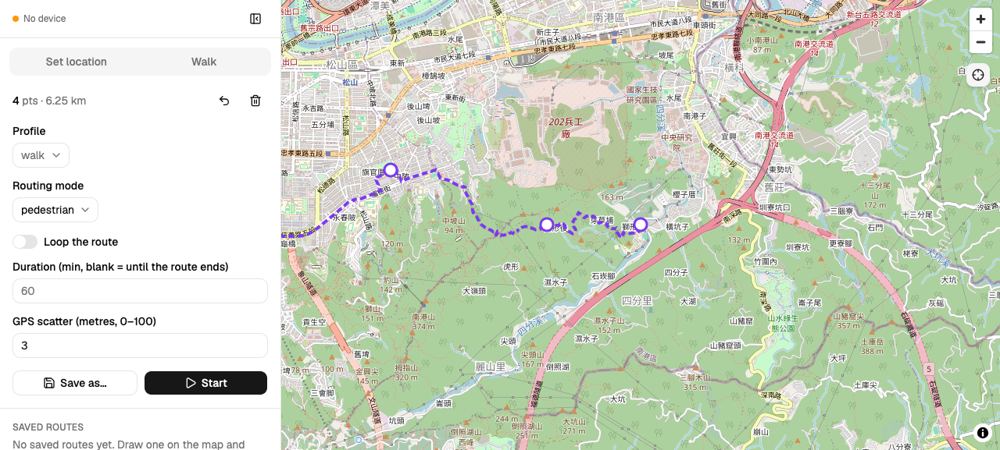

# ios-loc

Simulate GPS location on iOS 17+ devices, built on `pymobiledevice3`.

## Setup

```bash
uv sync
```

Start tunneld once per boot (needs sudo — it creates the Mac↔iPhone tunnel):

```bash
sudo pymobiledevice3 remote tunneld -d
```

Then check everything is reachable:

```bash
uv run ios-loc doctor
```

## Usage

```bash
# Walk a route, looping, for three hours
uv run ios-loc walk --via 25.033,121.565 --via 25.038,121.568 --loop --duration 3h

# Cycle instead (also switches routing to bicycle paths)
uv run ios-loc walk --via 25.033,121.565 --via 25.038,121.568 --profile bike --loop

# Use a named preset
uv run ios-loc walk home-loop

# Hold a fixed point
uv run ios-loc set 25.0330 121.5654

# Restore real GPS
uv run ios-loc clear
```

## Map GUI

```bash
uv run ios-loc gui               # serves 127.0.0.1:8765 and opens a browser
uv run ios-loc gui --no-open --port 9000
uv run ios-loc gui --offline     # disables routing; saved presets still work
```



The page is a full-screen map beside a sidebar (open by default, collapsible;
it overlays the map on narrow screens). The sidebar has two tabs, and the tab
you are on decides what a map tap does:

- **Set location** — a coordinate box (paste `lat,lon`, e.g.
  `48.858666,2.293991`), a save-place form, and your saved places. On this tab,
  tapping the map holds the device at that point — the GUI form of `ios-loc
  set`. Naming a coordinate saves it as a place; picking one sets the device
  there. Stop releases it, same as it ends a walk. With no device connected the
  coordinate is still saved as a place, just not pushed to a phone.
- **Walk** — the route editor and everything a walk needs. On this tab, tapping
  the map adds a waypoint; drag to move one, click it to remove it. Each edit
  re-routes through Valhalla (debounced ~300 ms) and draws the returned
  polyline. Set profile, routing mode, loop, duration, and GPS scatter, then
  Start. Saving writes a `[presets.<name>]` table back to the config, so
  `ios-loc walk <name>` works on anything you draw, and your saved routes are
  listed below the editor. While a walk runs, this tab becomes the live view —
  elapsed, distance, speed, laps, reconnects, and a Stop button.

While a walk runs, the map follows the live dot with a fading trail of the last
120 fixes; panning detaches following and the crosshair button reattaches it.

Two things worth knowing:

- **The run lives in the server process.** Quitting `ios-loc gui` ends the walk.
  A walk started from a terminal is invisible to the GUI, and starting a second
  one from the browser fails at the device layer with the error shown in the UI.
  Relatedly: the GUI server owns the run, and a single Ctrl-C (or a plain
  `kill`/SIGTERM) clears the device and ends the walk before the process exits.
  A second Ctrl-C, or anything that force-kills the process (`kill -9`, a
  crash), skips that cleanup and leaves the device frozen at its last simulated
  location — if that happens, run `ios-loc clear` to recover it.
- **Saving a preset rewrites the `[presets.*]` tables.** Comments and hand
  formatting inside those tables are lost. `[profiles.*]` and every other section
  are preserved byte for byte, CRLF included.

The map needs network access for OpenStreetMap tiles even under `--offline`,
which disables routing only.

#### Developing the UI

```bash
cd src/ios_loc/web/ui
pnpm install
pnpm dev          # vite on 5173, proxying /api and /ws to uvicorn on 8765
pnpm test run     # pure-logic tests (reducer, store, follow mode, API client)
pnpm build        # writes the committed bundle to ../static
pnpm gen:api      # regenerates src/api/schema.d.ts from api-schema.json
```

`src/ios_loc/web/static/` is committed, so `uv sync` alone is enough to run the
tool — but it means **a UI change is not shipped until you re-run `pnpm build`
and commit the result.**

## Config

`~/.config/ios-loc/config.toml`:

```toml
[profiles.jog]
speed = 2.6            # m/s — must stay under 5.56 (20 km/h)
jitter = 0.10
pause_per_min = 0.05
pause_min_s = 5
pause_max_s = 20
costing = "pedestrian"

[presets.home-loop]
waypoints = [[25.033, 121.5654], [25.038, 121.568], [25.033, 121.5654]]
profile = "walk"
loop = true

[places.home]
point = [25.033, 121.565]
```

**Presets** are routes with waypoints, profile, and loop settings, loaded via the GUI
or `ios-loc walk <name>`. **Places** are single coordinates saved from the GUI's Pin
control, listed under Places in the route library, and clicking one sets the device
there. Deleting a route or place from the GUI rewrites this file, preserving comments
and hand formatting outside the `[presets.*]` and `[places.*]` tables — `[profiles.*]`
and every other section are untouched.

## Notes

- **Speeds above 20 km/h are rejected.** Pikmin Bloom stops crediting distance
  above roughly that speed, so an over-speed run would silently produce nothing.
- **Routes are cached** to `~/.cache/ios-loc/routes`. `--offline` fails fast rather
  than hitting the network, which is what you want for unattended overnight runs.
- **Routing uses the public FOSSGIS Valhalla server.** To run it locally instead,
  start `ghcr.io/gis-ops/docker-valhalla/valhalla` and point `ValhallaClient`'s
  `base_url` at `http://localhost:8002` — it speaks an identical API.
